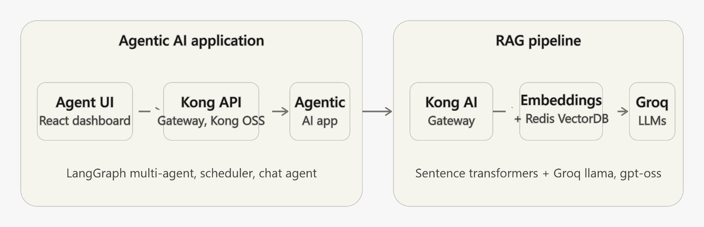
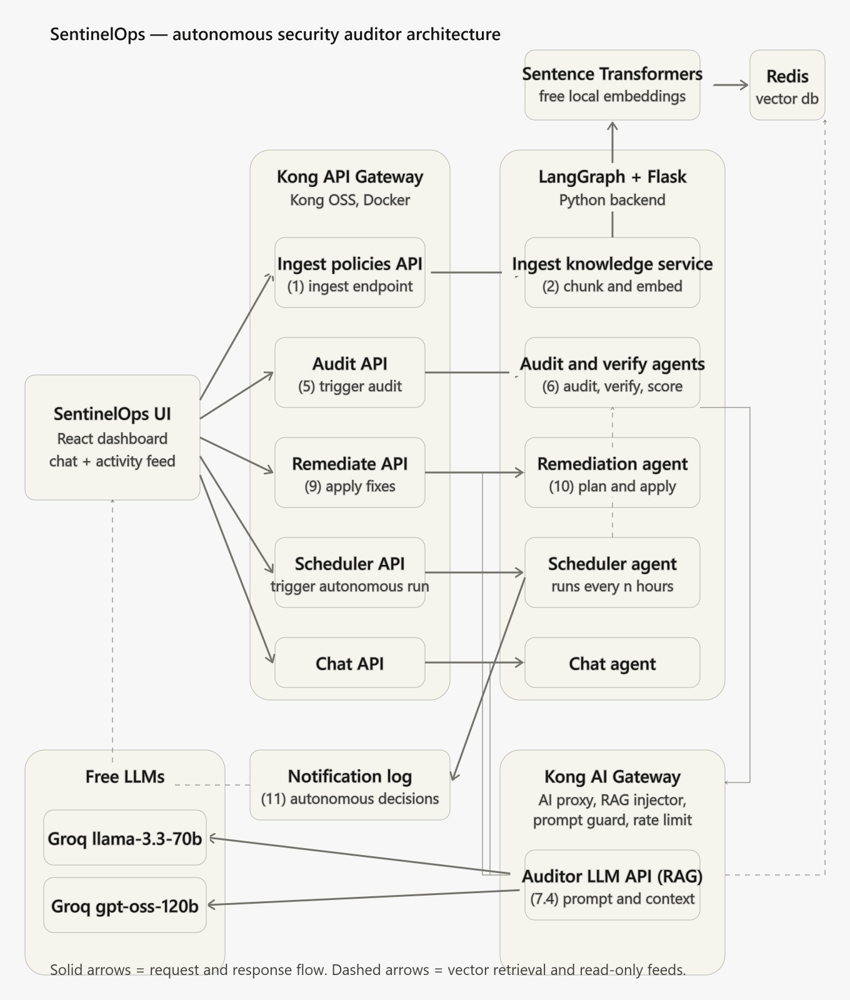

# 🚀 Project Title: AuditPilot (Autonomous Security Auditor Agentic AI)

## 🧠 Project Description

**AuditPilot (Autonomous Security Auditor Agentic AI)** is a cutting-edge solution that transforms how enterprises audit and secure their APIs on **Kong API Gateway** and **Kong AI Gateway**. By combining **Agentic AI workflows**, **LLMs**, and **Kong's intelligent plugins**, this tool autonomously audits API configurations against enterprise security policies and enables one-click remediation—empowering teams to maintain compliance effortlessly.

## 🔍 What Problem Does It Solve?

In large organizations, enforcing consistent API security policies—like authentication, authorization, GDPR compliance, and naming standards—is a daunting challenge. Manual reviews are slow, error-prone, and require deep policy expertise. This leads to:

- Security gaps and data exposure
- Non-compliance with internal and external regulations
- Increased operational overhead for DevSecOps teams

## 🛠️ How Does It Solve It?

Our agentic solution **automates the entire audit lifecycle**:

- **Continuously scans Kong API configurations**
- **Validates them against enterprise security policies**
- **Generates actionable audit reports**
- **Offers one-click remediation**

It empowers developers, architects, and auditors to ensure every API is secure and compliant—without needing to be policy experts.

## 🤖 How It Relates to the Agentic AI Theme

This project is a **true embodiment of Agentic AI**:

- **Autonomous agents** perform audits and remediation
- **LLMs** interpret complex policy documents and apply them contextually
- **Kong AI Gateway** powers intelligent prompt injection, retrieval-augmented generation (RAG), and ethical filtering
- **LangGraph orchestration** enables multi-agent collaboration for scalable, intelligent decision-making

## 🧩 Why Kong AI Gateway Is Critical

Kong AI Gateway is the **intelligence engine** behind this solution. With features like:

- **AI Proxy** for seamless LLM integration
- **RAG Injector** for real-time policy retrieval
- **Prompt Guard** for ethical and secure prompt handling
- **Response Transformer** for dynamic output shaping

…it ensures every audit is **context-aware, policy-driven, and performance-optimized**. Without Kong AI Gateway, this level of autonomy and precision wouldn't be possible.

---

# 🏗️ Solution Architecture

## High-Level Design

The solution is organized into two major components: the **Agentic AI Application** (UI, Kong API Gateway, LangGraph-based multi-agent backend) and the **RAG Pipeline** (Kong AI Gateway, embeddings, vector DB, and LLMs).



- **Agentic AI Application**: Agent UI (React dashboard) → Kong API Gateway (Kong OSS) → Agentic AI app, powered by LangGraph multi-agent orchestration, scheduler, and chat agent.
- **RAG Pipeline**: Kong AI Gateway → Embeddings + Redis VectorDB → LLMs (Sentence transformers + Groq llama, gpt-oss).

## Complete Architecture — SentinelOps

The detailed end-to-end architecture below shows the full request/response flow across the UI, Kong API Gateway, LangGraph + Flask backend agents, Kong AI Gateway, vector database, and LLM providers.



### Architecture Flow Summary

1. **SentinelOps UI** (React dashboard with chat + activity feed) is the single entry point for users.
2. **Kong API Gateway** (Kong OSS, Docker) exposes five core APIs:
   - **Ingest Policies API** — triggers ingestion of organizational security policies
   - **Audit API** — triggers an audit run
   - **Remediate API** — applies remediation fixes
   - **Scheduler API** — triggers an autonomous scheduled run
   - **Chat API** — powers the conversational chat agent
3. **LangGraph + Flask backend** hosts the core agents:
   - **Ingest Knowledge Service** — chunks and embeds policy documents, using **Sentence Transformers** for free local embeddings, stored in **Redis VectorDB**
   - **Audit and Verify Agents** — audit, verify, and score Kong configurations
   - **Remediation Agent** — plans and applies fixes
   - **Scheduler Agent** — runs autonomous audits every N hours
   - **Chat Agent** — handles conversational queries
4. **Kong AI Gateway** (AI Proxy, RAG Injector, Prompt Guard, Rate Limiting) fronts the **Auditor LLM API (RAG)**, which sends prompts plus retrieved policy context to free LLMs:
   - **Groq llama-3.3-70b**
   - **Groq gpt-oss-120b**
5. **Notification Log** records autonomous decisions made by the scheduler and remediation agents.
6. Dashed arrows represent **vector retrieval and read-only feeds** (e.g., Redis VectorDB feeding the Auditor LLM API, and Free LLMs feeding the Notification Log); solid arrows represent **request/response flows**.

---

## Agentic AI Tools Developed

As part of this Agentic AI application, two major AI agents were developed:
- **Agentic AI Application** (React UI + Kong API and AI Agents + LangGraph + Flask + Azure LLM)
- **RAG Pipeline** (Kong AI Gateway + Redis as VectorDB + Azure LLM)

## Technology Stack
- Kong AI Gateway
- Kong API Gateway
- Redis as VectorDB
- Python + Flask + LangGraph
- ReactJS + TailwindCss + Typescript
- AI Technologies - Any LLM e.g. Azure gpt-4.1 model, OpenAI Embedding Model, Groq (llama-3.3-70b, gpt-oss-120b), Sentence Transformers

## Kong AI Plugins Used

| Kong AI Feature/Plugin | Strategic Value for Autonomous Security Auditor Agent |
|------------------------|--------------------------------------------------------|
| AI Proxy Advanced | Enabled seamless integration of multiple LLMs (Azure GPT-4.1, Gemini-2-Flash) through a unified API layer. This allowed the agent to intelligently route requests based on audit context, improving performance and scalability across diverse security validation tasks. |
| AI Rate Limiting Advanced | Enforced granular usage controls per consumer application, ensuring cost-effective LLM consumption. This was critical for managing token budgets while maintaining high availability of the auditing agent across teams. |
| AI Prompt Decorator | Injected system-level context into every prompt, ensuring the LLM consistently operated as a focused security auditor. This improved audit precision and reduced prompt engineering overhead. |
| AI Prompt Guard | Applied ethical and hallucination filters to LLM inputs, safeguarding the agent from generating misleading or non-compliant audit results. This enhanced trust and reliability in automated policy enforcement. |
| AI RAG Injector | Built a dynamic RAG pipeline that injected enterprise security policies as context during audits. This eliminated the need for extensive LLM fine-tuning, reduced operational costs, and ensured real-time policy-aware compliance checks. |
| AI Response Transformer | Transformed verbose LLM outputs into structured audit reports containing only relevant fields (e.g., service name, compliance status, violated policies). This streamlined reporting and improved clarity for DevSecOps teams. |
| Unified LLM Dashboard | Provided a centralized view of agent activity, token usage, and consumer behavior. This enabled governance, cost tracking, and performance optimization of the Autonomous Security Auditor Agent across the organization. |

## API Catalog

| API Name                        | Description                                                        | API URL                                                                 | Method |
|----------------------------------|--------------------------------------------------------------------|-------------------------------------------------------------------------|--------|
| Ingest Knowledge API (Kong API GW)      | Ingest organization security policies to the Redis vector database         | http://localhost:5001/api/v1/knowledge/ingest OR https://{KONG_DP_DNS}/api/v1/knowledge/ingest                           | POST   |
| Auditor Agent AI API (Kong AI GW)       | Azure LLM exposed via Kong AI gateway's unified API                       | https://{KONG_DP_DNS}/api/v1/agents/auditor             | POST   |
| Audit API Configs API (Kong API GW)     | Audit AI Agent API used to audit Kong configurations                       | http://localhost:5000/api/v1/ai-agents/audit OR https://{KONG_DP_DNS}/api/v1/ai-agents/audit                            | POST   |
| Remediate API Configs API (Kong API GW) | Enables remediation as per organization security policies                  | http://localhost:5000/api/v1/ai-agents/remediate OR https://{KONG_DP_DNS}/api/v1/ai-agents/remediate                        | POST   |
| Scheduler API (Kong API GW)             | Triggers an autonomous scheduled audit run                                 | http://localhost:5000/api/v1/ai-agents/scheduler OR https://{KONG_DP_DNS}/api/v1/ai-agents/scheduler                        | POST   |
| Chat API (Kong API GW)                  | Conversational chat agent for querying audit status and policies           | http://localhost:5000/api/v1/ai-agents/chat OR https://{KONG_DP_DNS}/api/v1/ai-agents/chat                                  | POST   |

---

# Installation and Setup Prerequisites

## Frontend Requirements

Install the following technologies on the system where the UI application will run:
- ReactJS
- TailwindCSS
- npm
- TypeScript

## Backend Requirements

- Access to Kong products:
  - Kong Konnect
  - Kong Gateway
  - Kong AI Gateway
- Python and required libraries listed in `requirements.txt`
- Environment variables configured in the `.env` file
- Organization-specific security policies placed in the `knowledge_base` directory
- Redis database installed and accessible from Kong Gateway server
- Docker installed (if using containerized setup)
- Credentials and configuration details for LLM models (e.g., Azure GPT-4.1, text-embedding-3-small, Groq llama-3.3-70b, Groq gpt-oss-120b, Sentence Transformers for free local embeddings)

---

# 🛠️ Installation Guide

This project implements a complete **RAG-based Agentic AI pipeline** using Kong AI Gateway, Azure GPT-4.1, OpenAI Embedding, Redis VectorDB, LangGraph, Flask, and React. It includes:

- **RAG Pipeline (Backend)** for ingesting and querying security policies.
- **Agentic AI (Backend)** with Audit, Remediation, Scheduler, and Chat agents.
- **ReactJS UI (Frontend)** for interacting with the system.

---

## 📦 RAG Pipeline Setup (Backend)

### 1. Install Redis Vector Database

Redis is used as the VectorDB for storing embedded security policies.

**For development environment:**

#### Option 1: Docker
```
docker compose up -d
```

#### Option 2: Helm
```
helm repo add redis-stack https://redis-stack.github.io/helm-redis-stack
helm repo update
helm install redis-stack redis-stack/redis-stack -n redis --create-namespace
```

### Create Organization Security Policies
- Create organization specific mandatory security policies and store them in `knowledge_base` directory
- Sample files are provided for reference
- These security policies will be ingested into the organization knowledge base vector database later

### Run Ingest Knowledge Python
```
cd rag
python knowledge_ingestor.py
```

### Kong AI Gateway Configuration
- Ensure to create Kong AI Gateway, service, routes, and attach various AI plugins
- `kong.yaml` contains all Kong AI configuration details — publish them to Kong Gateway
- Ensure to have a consumer app key available

---

## Installation Steps - Agentic AI (backend) - Audit, Remediation, Scheduler, and Chat Agents

We developed four agents: **audit**, **remediation**, **scheduler**, and **chat**.

- The **Audit Agent** fetches Kong configurations from Kong Gateway using Kong Admin APIs and sends plugin configuration to the LLM and RAG API to validate compliance status.
- The **Remediation Agent** prepares a remediation plan based on the audit report.
- The **Scheduler Agent** runs autonomous audits on a recurring basis (every N hours) and logs decisions to the Notification Log.
- The **Chat Agent** provides a conversational interface for querying audit results and policies.

We are using Python, LangGraph, React, and Flask to create AI agents, and Kong API Gateway to expose the agent APIs.

### Install Python libraries
```
cd autonomous-security-auditor-agent
pip install -r requirements.txt
```

### Run AI Agents - Audit, Remediate, Scheduler, and Chat
- Create virtual environment
```
python -m venv venv
venv\Scripts\activate
python init_auditor.py
```
- Refer to the API Catalog for endpoint details

### Develop Kong API Proxies
- Create proxies for the Agentic AI Flask APIs: `/audit`, `/remediate`, `/scheduler`, `/chat`
- These are traditional Kong API proxies where additional security can be applied
- Flask API routes were used locally for development; Kong API proxy configs for these routes are not included in this repo

### Install ReactJS UI for Agentic AI Application (frontend)
- The UI for the Agentic AI Application connects to the Agentic AI backend through Kong API Gateway
- Built using React.js + TailwindCSS + TypeScript
- Ensure the frontend is connecting to Kong APIs
- Run commands:
```
cd autonomous-security-auditor-agent/frontend
npm install
npm start
```

---

# Testing Process

1. Run the Knowledge Ingestion Python server (if not already running)
```
cd autonomous-security-auditor-agent/backend/rag
python knowledge_ingestor.py
```

2. Configure the Knowledge Ingestion API in `Dashboard.jsx`
```
http://localhost:5001/api/v1/knowledge/ingest
```

3. Run the Audit, Remediate, Scheduler, and Chat Agents
```
cd autonomous-security-auditor-agent/backend/agents
python init_auditor.py
```

4. Configure the Agent APIs in the Dashboard
```
http://localhost:5000/api/v1/ai-agents/audit
http://localhost:5000/api/v1/ai-agents/remediate
http://localhost:5000/api/v1/ai-agents/scheduler
http://localhost:5000/api/v1/ai-agents/chat
```

5. Start the UI Application
```
cd autonomous-security-auditor-agent/frontend/
npm start
```

6. Open the UI Application

- Open http://localhost:3000/
```
username: kong_champion, password: Kong@123
```
- Click on `Ingest Security Policies` to ingest security policies into the Redis database
- Click on `Start Security Audit and Generate Report` to validate your Kong proxies/services against organization security policies and check for missing mandatory plugins
- Click on `Run Remediation Plan` to apply suggested fixes
- Use the **Scheduler** controls to enable autonomous periodic audits
- Use the **Chat** panel to ask questions about audit status, policies, and remediation history

---

# User Manual - Steps to Execute the Application

Refer to the document below for detailed steps to execute the Autonomous Security Auditor Agentic AI application.

[User Manual - Execution Steps for Autonomous Security Auditor Agents.pdf](<User Manual - Execution Steps for Autonomous Security Auditor Agents.pdf>)